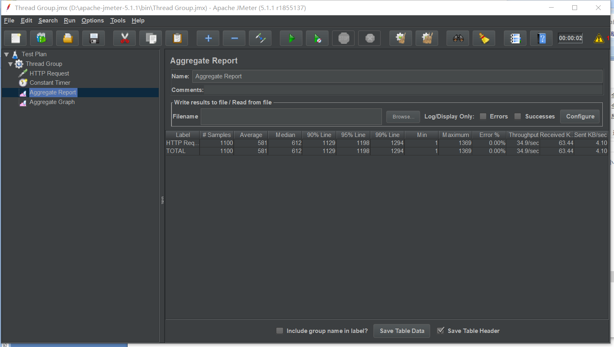
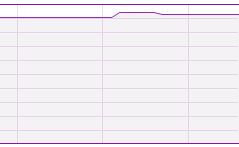

#  task2
##  测试了login的网址线程，只测了1000线程和5000线程，10000的时候程序崩了
##  进程越多占用内存cpu越多，不同的请求占用情况也不同，查询占用存储很大
### jmeter
#### 1000线程

#### 5000线程

### memory
#### 1000线程

#### 5000线程

### cpu
#### 1000线程

#### 5000线程

